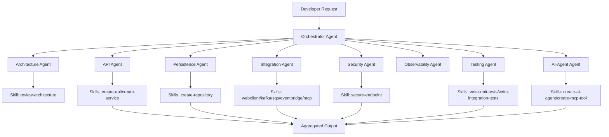
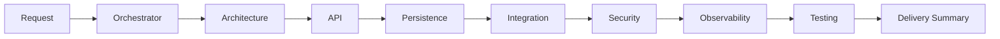
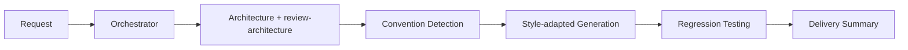
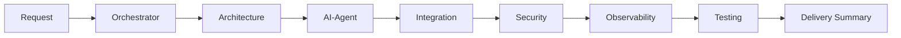

# Enterprise GitHub Copilot Customization Framework

## Purpose
Reusable framework for Spring Boot and Spring WebFlux teams that separates:
- Agent orchestration responsibilities
- Skill implementation knowledge
- Shared engineering standards

## Responsibility model
- Agents: intent analysis, routing, orchestration, aggregation.
- Skills: templates, implementation guidance, best practices, examples, validation.
- Instructions: cross-cutting standards applied consistently.
- Prompts: reusable entry points that leverage Orchestrator orchestration.

## Component map


## Workflow patterns

### Greenfield workflow


### Existing project workflow


### AI-agent workflow


## Architectural style awareness
Supported styles:
- Layered Architecture
- Hexagonal Architecture
- Event-Driven Architecture
- Domain-Driven Design

Generation adapts by style and detected conventions.

## Existing application adaptation checklist
Before generation:
1. Analyze structure and module boundaries.
2. Detect architecture style.
3. Detect coding and naming conventions.
4. Detect frameworks and integrations.
5. Detect security patterns.
6. Detect testing patterns.

## Integration support matrix
- REST APIs
- WebClient
- Kafka
- SQS
- EventBridge
- OpenSearch/Elasticsearch
- AWS SDK
- Bedrock
- MCP servers/tools

## Observability coverage
- Micrometer metrics
- Prometheus scrape compatibility
- OpenTelemetry tracing
- Correlation ID propagation
- Structured logging
- Health checks and operational readiness

## Testing coverage
- Unit tests
- Integration tests
- Testcontainers
- StepVerifier
- WebTestClient
- Contract testing
- Performance testing

## Example orchestration request
```text
Use Orchestrator to add a new payments API in an existing WebFlux service.
Run architecture review first, adapt to existing style, implement endpoint + persistence + security,
and provide unit/integration tests with summary report.
```
